## android手机示波器程序

### 一、课程设计要求

1、手机示波器由手机端软件，数据采集探头（传感器）组成。传感器通过蓝牙(或wifi)传送到手机的数据，经程序处理后，以波形的方式在屏幕上显示。

2、传感器用pc机或另一台手机模拟，手机端包括简单的UI设计，蓝牙(或wifi)通信接口设计，波形显示和存储，数据库设计

3、程序要求稳健（要有异常处理），界面美观，操作方便，规定使用 Android4.2开发。

### 二、程序截图

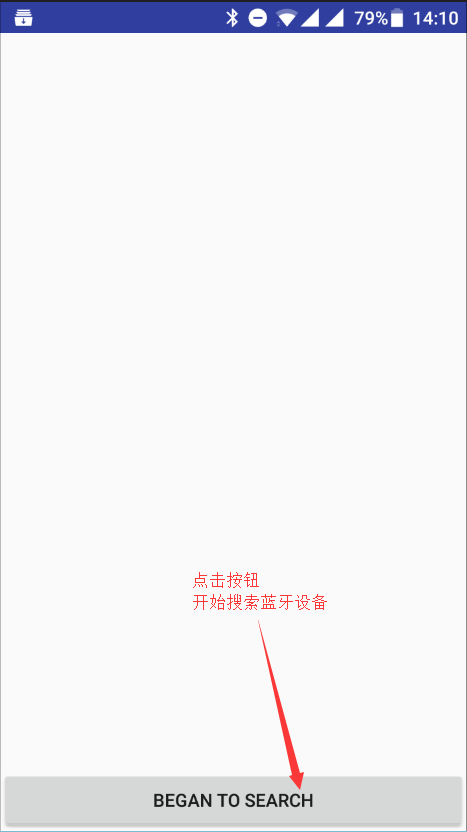
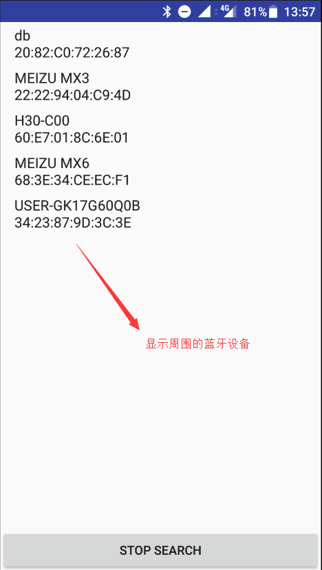

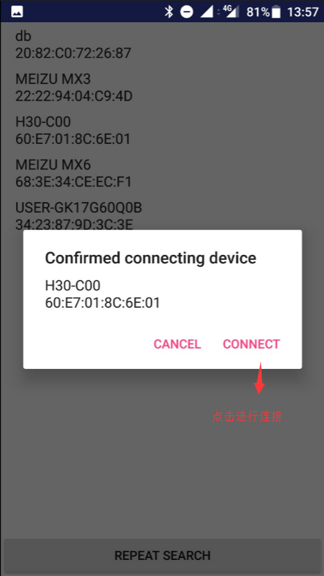

 

客户端和服务端互相连接后，出现如下的界面

 

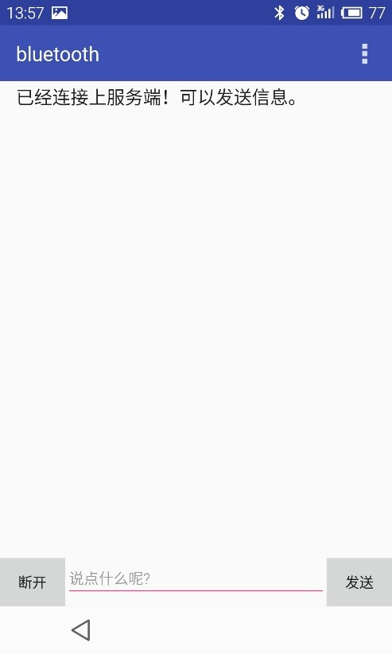
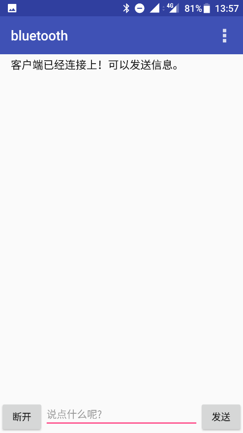

 

点击右上角的 按钮，出现菜单（以服务端为例）

 

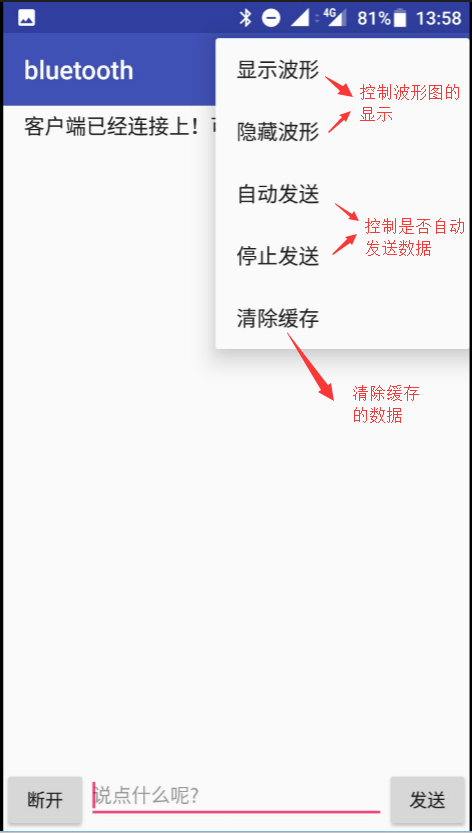

 

点击显示波形，开启自动发送功能

 
PS：操作时这里只开启了客户端向服务端的自动发送，这里是可以双向开启的（即双向开启自动发送，详见下图），收到的数据默认处理为y轴以下数据（负数），发出的数据默认处理为y轴以上数据（正数）。这里的自动发送的是发送随机1-10个字符*b*（收发的数据同样显示到折线图上方的列表上）。

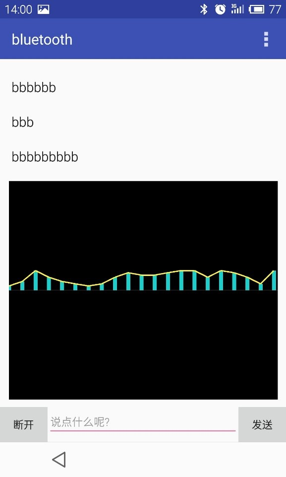
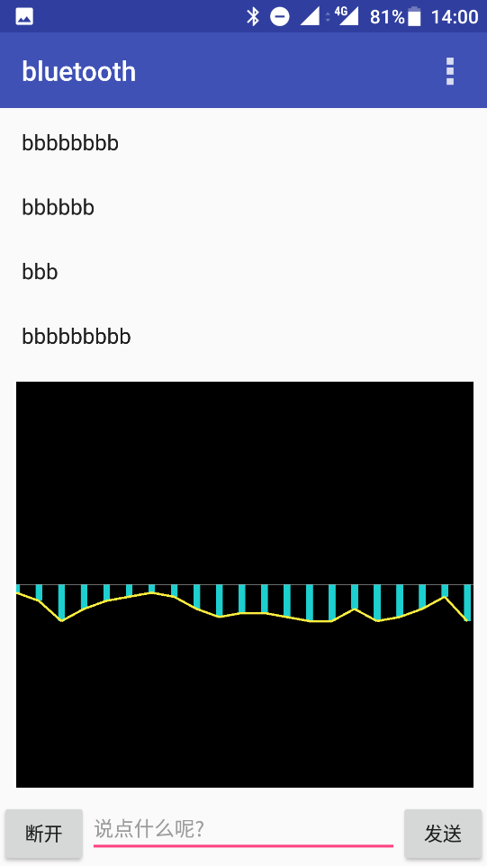

 

双向开启自动发送

 

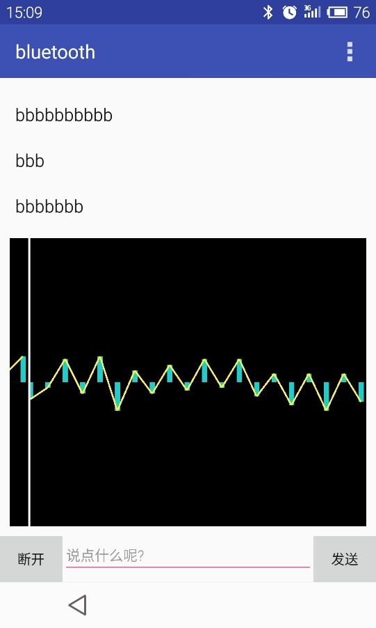
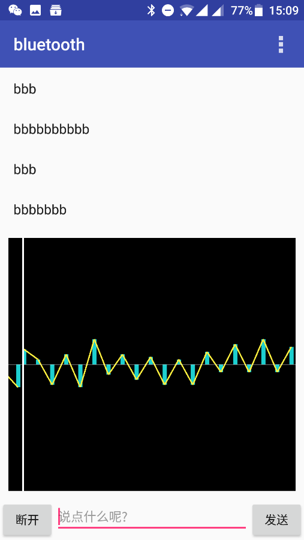

 

在下方的文本框中输入字符串，点击发送可以手动发送数据

 

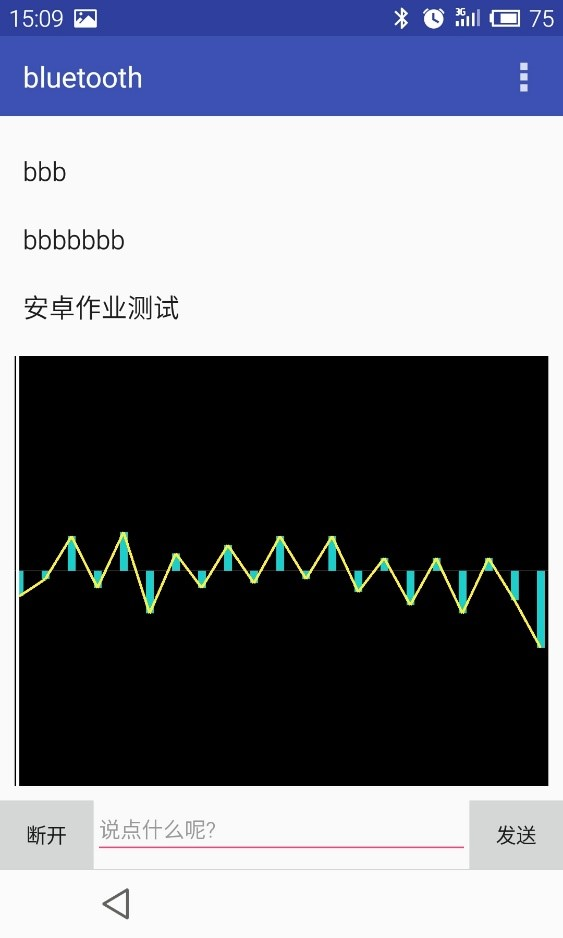
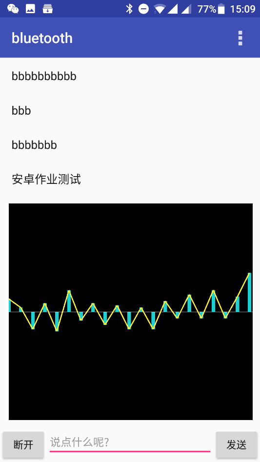

